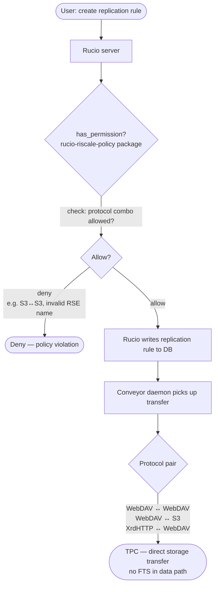

# opa-policy-package
Rucio policy package integrating Open Policy Agent for experiment-specific permission and schema customisation

## Phase 1 — Standalone policy package (no OPA)

### TODO
- Develop rucio-riscale-policy package overriding `has_permission()` with inline Python logic
- Enforce allowed source→destination protocol combos directly in package
  - Block S3↔S3 — no TPC support
  - Allow WebDAV↔WebDAV and WebDAV↔S3 as primary TPC paths
- Enforce RSE naming conventions 
- Add e2e tests covering allow/deny scenarios per selected permission action
  - Include protocol combo allow/deny scenarios (e.g. S3↔S3 blocked, WebDAV↔S3 allowed)

---

## Phase 2 — OPA integration as PDP

### TODO
- Define integration plan: select target permission actions from generic.py (e.g. RSE management, replication rules, DIDs) to delegate to OPA as PDP
- Add docker-compose.yml with Rucio server and OPA container (AuthZ)
- Ingest Rego policies into OPA via available interfaces covering the selected permission actions (Refer to: https://github.com/federicaagostini/opa-ri-scale/tree/main)
- Develop rucio-opa-policy package overriding `has_permission()` to delegate all decisions to OPA
- Migrate Phase 1 inline logic into Rego policies in OPA covering:
  - Allowed source→destination protocol combos
  - RSE naming conventions 
- Add e2e tests covering OPA communication and allow/deny scenarios per selected permission action

---

## Ref
- [Rucio: Policy Packages tutorial](https://indico.cern.ch/event/1545309/contributions/6742067/attachments/3167370/5629550/Policy%20Package%20Tutorial.pdf)
- [policy-package-template GH repository](https://github.com/rucio/policy-package-template)
- [opa-ri-scale reference implementation](https://github.com/federicaagostini/opa-ri-scale/tree/main)
