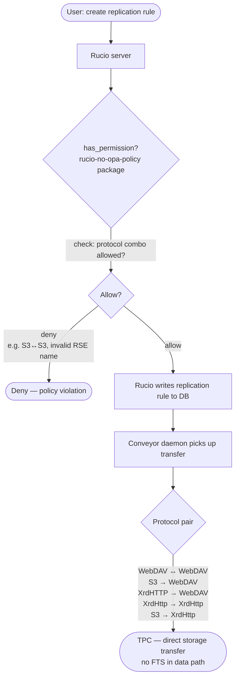
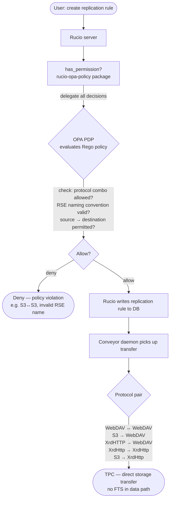

# opa-policy-package

Rucio policy packages — two phases with a clear separation of concerns:

| Phase | Package | Who decides? | Where is the logic? |
|-------|---------|-------------|---------------------|
| 1 | `rucio-no-opa-policy` | Rucio (PDP) | Inline Python (`rules.py`) |
| 2 | `rucio-opa-policy` | OPA (PDP) | Rego (`phase2-opa/rego/`) |

> See [Policy package mechanism](docs/policy-package-mechanism.md) on how Rucio loads policy packages

---

## Repository layout

```
opa-policy-package/
│
├── phase1-no-opa/               # Phase 1 — Rucio as PDP
│   ├── pyproject.toml
│   ├── README.md
│   ├── LICENSE
│   └── src/rucio_no_opa_policy/
│       ├── __init__.py           # SUPPORTED_VERSION
│       ├── permission.py         # has_permission() dispatch
│       └── rules.py              # Protocol & RSE naming logic (pure Python)
│
├── phase2-opa/                   # Phase 2 — OPA as PDP
│   ├── pyproject.toml
│   ├── README.md
│   ├── LICENSE
│   ├── src/rucio_opa_policy/
│   │   ├── __init__.py           # SUPPORTED_VERSION
│   │   ├── permission.py         # has_permission() → builds input → OPA
│   │   └── opa_client.py         # Thin stdlib HTTP client for OPA REST API
│   ├── rego/
│   │   └── authz.rego            # All authorisation logic in Rego
│   └── docker/
│       ├── docker-compose.yml    # OPA + PostgreSQL + Rucio server
│       ├── rucio.cfg             # Rucio server config (points at OPA package)
│       ├── ingest_policies.py    # Loads Rego + admin data into OPA via REST
│       ├── bootstrap-db.py       # Initialises the Rucio DB schema
│       └── smoke_test.sh         # End-to-end smoke tests for the full stack
│
├── tests/
│   ├── conftest.py               # Rucio stubs + shared fixtures (no live Rucio needed)
│   ├── test_phase1_rules.py      # Unit tests — protocol combos, RSE naming
│   ├── test_phase1_permission.py # Permission dispatch unit tests
│   ├── test_phase1_e2e_scenarios.py  # Scenario tests matching the flowchart
│   ├── test_phase2_opa.py        # OPA client + input construction tests (mocked)
│   └── test_phase2_e2e_scenarios.py  # Scenario tests against live OPA (skip if absent)
│
└── pyproject.toml                # pytest + ruff configuration
```

---

## Phase 1 — Rucio as PDP



### What it enforces

**Protocol combos** — TPC transfer paths (based on Transfer Scenarios Overview,
verified with Rucio/FTS maintainers). The destination storage initiates TPC by
pulling from the source — S3 cannot act as a TPC destination.
See [table in Transfer Scenarios Overview documentation](./docs/transfer-scenarios-overview.md).

**RSE naming** — must match `<SITE>_<TYPE>` where TYPE ∈
`{DATADISK, SCRATCHDISK, LOCALGROUPDISK, TAPE, USERDISK}`.

Examples: `CERN_DATADISK` ✓ · `BNL_TAPE` ✓ · `cern_datadisk` ✗ · `CERN_UNKNOWN` ✗

**Actions with custom logic** (all others fall back to root-or-admin):

| Action | Extra check |
|--------|-------------|
| `add_rule` | Protocol combo + RSE naming + standard account check |
| `add_rse` | Admin required **and** RSE name must be valid |
| `update_rse` | Admin required; if renaming, new name must be valid |

**Domain rules run before privilege checks** — even root cannot register
`cern_bad` as an RSE or push an S3→S3 transfer.

### Install

```bash
pip3 install -e phase1-no-opa/
```

### Configure Rucio

```ini
# rucio.cfg
[policy]
package = rucio_no_opa_policy
```

---

## Phase 2 — OPA as PDP



### Actions delegated to OPA

| Category | Actions |
|----------|---------|
| Replication rules | `add_rule`, `del_rule`, `update_rule`, `approve_rule` |
| RSE management | `add_rse`, `update_rse`, `del_rse`, `add_rse_attribute`, `del_rse_attribute` |
| Data Identifiers | `add_did`, `add_dids`, `attach_dids`, `detach_dids` |
| Everything else | → privileged-only fallback in Rego |

### OPA input document

Every call to `has_permission()` constructs and POSTs this document:

```json
{
  "issuer":   "alice",
  "action":   "add_rule",
  "is_root":  false,
  "is_admin": false,
  "kwargs": {
    "account":         "alice",
    "locked":          false,
    "rse_expression":  "CERN_DATADISK",
    "source_protocol": "webdav",
    "dst_protocol":    "s3"
  }
}
```

`is_admin` is resolved by `has_account_attribute()` in Python before the
HTTP call — Rego never needs a DB round-trip.

### Start OPA only

```bash
cd phase2-opa/docker
docker compose up -d opa opa-init
```

Seed admin accounts at startup:

```bash
VO_ADMINS=alice,bob docker compose up -d opa opa-init
```

### Start full stack (OPA + PostgreSQL + Rucio)

```bash
cd phase2-opa/docker
docker compose --profile full up -d
```

### Verify the full stack

```bash
# Ping
curl http://localhost/ping
# → {"version":"39.4.1"}

# Authenticate
TOKEN=$(curl -s -X GET http://localhost/auth/userpass \
  -H "X-Rucio-Account: root" \
  -H "X-Rucio-Username: ddmlab" \
  -H "X-Rucio-Password: secret" \
  -D - | grep "X-Rucio-Auth-Token:" | awk '{print $2}' | tr -d '\r')

# Valid RSE name — OPA allows → 201
curl -s -o /dev/null -w "%{http_code}" -X POST http://localhost/rses/CERN_DATADISK \
  -H "X-Rucio-Auth-Token: $TOKEN" \
  -H "Content-Type: application/json" \
  -d '{"rse_type": "DISK"}'

# Invalid RSE type — OPA denies → 401
curl -s -o /dev/null -w "%{http_code}" -X POST http://localhost/rses/CERN_UNKNOWN \
  -H "X-Rucio-Auth-Token: $TOKEN" \
  -H "Content-Type: application/json" \
  -d '{"rse_type": "DISK"}'

# Run the full smoke test suite (21 checks across all Rego rules)
bash smoke_test.sh
```

### Install policy package

```bash
pip3 install -e phase2-opa/
```

### Configure

```bash
export RUCIO_POLICY_PACKAGE=rucio_opa_policy
export OPA_URL=http://localhost:8181     # default
export OPA_POLICY_PATH=vo/authz/allow   # default
export OPA_TIMEOUT=2                    # seconds, default
```

### Ingest policies manually

```bash
python3 phase2-opa/docker/ingest_policies.py \
    --opa-url http://localhost:8181 \
    --admins alice,bob,svcaccount
```

### Fail-closed behaviour

If OPA is unreachable, `query_opa()` returns `False` — the request is
denied and the error is logged at `ERROR` level in Rucio server logs.

---

## Running the tests

No Rucio installation needed — Rucio modules are stubbed in `conftest.py`.

```bash
# From the repository root
pip3 install pytest
python3 -m pytest                    # 107 tests (Phase 2 e2e skipped without OPA)

# Phase 2 e2e tests against live OPA
cd phase2-opa/docker && docker compose up -d opa opa-init
cd ../..
OPA_URL=http://localhost:8181 python3 -m pytest tests/test_phase2_e2e_scenarios.py -v
cd phase2-opa/docker && docker compose down

# With coverage
pip3 install pytest-cov
python3 -m pytest --cov=phase1-no-opa/src --cov=phase2-opa/src --cov-report=term-missing
```

### Test structure

| File | Tests | What it covers |
|------|-------|----------------|
| `test_phase1_rules.py` | 35 | Pure domain logic — protocol combos, RSE naming, kwargs validation |
| `test_phase1_permission.py` | 21 | `has_permission()` dispatch, all covered actions |
| `test_phase1_e2e_scenarios.py` | 30 | Scenario tests: flowchart allow/deny paths |
| `test_phase2_opa.py` | 21 | OPA client (mocked HTTP), fail-closed, input construction |
| `test_phase2_e2e_scenarios.py` | 39 | Live OPA scenarios: protocol combos, RSE naming, DIDs, RSE attrs |

### Smoke test coverage

`smoke_test.sh` exercises all Rego rules end-to-end:

| Section | Checks |
|---------|--------|
| Pre-flight | OPA health, Rucio ping |
| Auth | Token acquisition |
| Rucio API: RSE | Create valid RSEs, schema rejection, OPA rejection |
| Rucio API: Account + Scope | Create, get, list |
| OPA: protocol combos | All 4 allowed pairs + 2 denied + no-hints + case insensitivity |
| OPA: RSE naming | Valid names, lowercase, unknown type, expression operators |
| OPA: account checks | Own rule, locked rule, other account, root, admin |
| OPA: privileged rule actions | `del_rule`, `update_rule`, `approve_rule` |
| OPA: privileged RSE actions | `del_rse`, `add_rse_attribute`, `del_rse_attribute` |
| OPA: update_rse | Valid rename, invalid rename, no rename, user denied |
| OPA: DID actions | Root, scope owner, mock scope, other scope denied |
| OPA: unknown action fallback | Root allowed, user denied |
| OPA log verification | Policy loaded, authz endpoint hit count |

---

## References

- [Rucio Policy Packages tutorial](https://indico.cern.ch/event/1545309/contributions/6742067/attachments/3167370/5629550/Policy%20Package%20Tutorial.pdf)
- [policy-package-template](https://github.com/rucio/policy-package-template)
- [opa-ri-scale reference implementation](https://github.com/federicaagostini/opa-ri-scale/tree/main)
