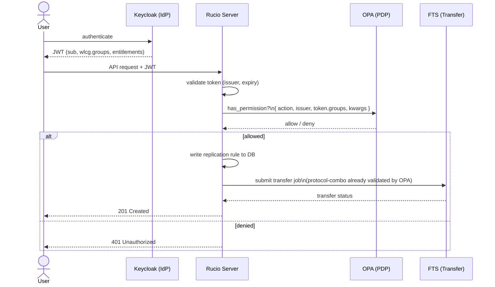

# opa-policy-package

Rucio policy packages across four phases of increasing capability:

| Phase | Package | Who decides? | Where is the logic? |
|-------|---------|-------------|---------------------|
| 1 | [`rucio-no-opa-policy`](phase1-no-opa/README.md) | Rucio (PDP) | Inline Python (`rules.py`) |
| 2 | [`rucio-opa-policy`](phase2-opa/README.md) | OPA (PDP) | Rego (`phase2-opa/rego/`) |
| 3 | [`rucio-opa-v2-policy`](phase3-opa/README.md) | OPA (PDP) | Rego (`phase3-opa/rego/`) + data bundle |
| 4 | [`rucio-opa-v3-policy`](phase4-opa/README.md) | OPA (PDP) | Rego (`phase4-opa/rego/`) + group policy bundle + Keycloak |

> See [Policy package mechanism](docs/policy-package-mechanism.md) for how Rucio loads policy packages.
> See [Action → Policy Mapping](docs/action-policy-mapping.md) for the full `has_permission()` coverage map — **required reading for writing meaningful Rego or ODRL policies** (action strings, available input fields and domain checks that apply independently of privilege).
> See [Policy Lifecycle](docs/policy-lifecycle.md) for the ODRL → OPA → Rucio relationship and input document options.

## TODO

- Derive phase 5 from phase 4 which should also include integration with FTS and one source and one destination storage system supporting third-party copy (e.g. StoRM WebDAV or dCache/Teapot), both configured to accept OIDC tokens. Work depends on progress in the [rucio-storage-testbed GH repository](https://github.com/mgajek-cern/rucio-storage-testbed).

## High-level vision



Phase 5 shall implement this vision e2e with all systems shown: Keycloak issues JWTs with `wlcg.groups`
claims; OPA evaluates group membership against `data.vo.group_policy` in the
bundle — no Rucio DB round-trip per authorisation decision.

## Group membership and URN entitlements

Phase 4 uses WLCG group paths (`/rucio/admins`, `/atlas/production`) as the
privilege signal. This is **conceptually equivalent** to URN-based entitlement
claims used in federated AAI deployments:

| Phase 4 (wlcg.groups) | URN entitlement equivalent |
|----------------------|---------------------------|
| `/rucio/admins` | `urn:...:group:rucio-admins:role=member` |
| `/atlas/production` | `urn:geant:atlas.cern.ch:group:production:role=member` |

OPA evaluates whichever claim format the IdP emits — the `data.vo.group_policy`
bundle is the mapping layer. To adopt URN entitlements instead of group paths,
update `ingest_policies.py` to push URN strings as keys and adjust the Rego
`_group_privilege` lookup accordingly. No changes to Rucio or the Python
permission module are needed.

This design is intentional: it gives any federated research infrastructure
deploying OPA as a PDP a clear integration path into Rucio's authorisation
layer, with the group-to-privilege mapping externalised and updatable at
runtime without redeployment.

An example OPA request body with a URN entitlement claim could resemble:

```json
{
    "input": {
        "action": "add_rule",
        "resource": { "rse_expression": "CERN_DATADISK" },
        "token": {
            "entitlements": [
                "urn:example:aai.example.org:group:rucio-admins:role=member"
            ]
        }
    }
}
```

## Repository layout

```
opa-policy-package/
│
├── phase1-no-opa/               # Phase 1 — Rucio as PDP
├── phase2-opa/                  # Phase 2 — OPA as PDP
├── phase3-opa/                  # Phase 3 — OPA as PDP, data-driven
├── phase4-opa/                  # Phase 4 — OPA as PDP, OIDC/wlcg.groups
│   ├── src/rucio_opa_v3_policy/
│   ├── rego/authz.rego
│   └── docker/                  # OPA + Keycloak + PostgreSQL + Rucio stack
│
├── tests/                       # Phase 1–3 unit + e2e tests
├── tests4/                      # Phase 4 e2e tests
└── docs/
    ├── policy-package-mechanism.md
    ├── action-policy-mapping.md
    ├── policy-lifecycle.md
    └── storage-transfer-overview.md
```

## Phase progression

Each phase is a drop-in replacement — configure Rucio to point at the
desired package and restart. No data migration required.

**Phase 1** enforces TPC protocol combos and RSE naming in pure Python with
no external dependencies. See [phase1-no-opa/README.md](phase1-no-opa/README.md).

**Phase 2** moves all policy logic to OPA/Rego, delegating a wider set of
actions and enabling richer ABAC without redeploying Python code.
See [phase2-opa/README.md](phase2-opa/README.md).

**Phase 3** extends Phase 2 with data-driven configuration, self-service rule
management, `attach_dids_to_dids` delegation and protocol scheme enforcement.
See [phase3-opa/README.md](phase3-opa/README.md).

**Phase 4** replaces the `is_root`/`is_admin` DB lookup with OIDC token-native
group evaluation — Keycloak issues JWTs with `wlcg.groups`; OPA evaluates them
against `data.vo.group_policy`. Zero DB calls per authorisation decision.
See [phase4-opa/README.md](phase4-opa/README.md).

## References

- [Rucio Policy Packages tutorial](https://indico.cern.ch/event/1545309/contributions/6742067/attachments/3167370/5629550/Policy%20Package%20Tutorial.pdf)
- [policy-package-template](https://github.com/rucio/policy-package-template)
- [opa-ri-scale reference implementation](https://github.com/federicaagostini/opa-ri-scale/tree/main)
