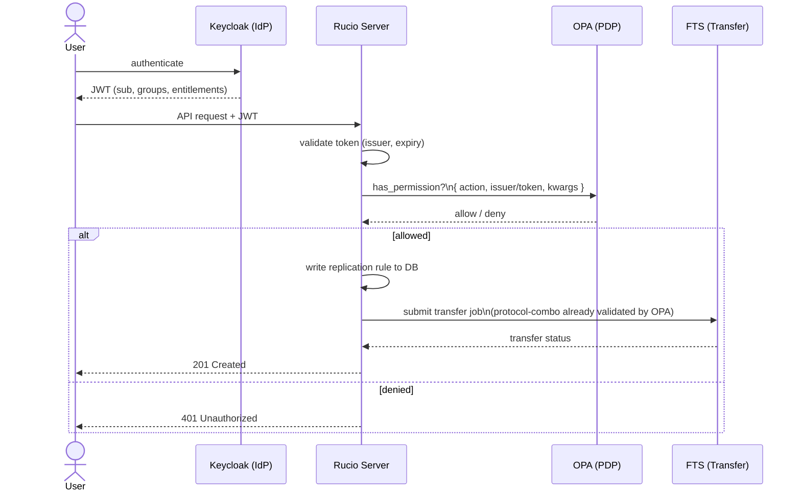

# opa-policy-package

Rucio policy packages across three phases of increasing capability:

| Phase | Package | Who decides? | Where is the logic? |
|-------|---------|-------------|---------------------|
| 1 | [`rucio-no-opa-policy`](phase1-no-opa/README.md) | Rucio (PDP) | Inline Python (`rules.py`) |
| 2 | [`rucio-opa-policy`](phase2-opa/README.md) | OPA (PDP) | Rego (`phase2-opa/rego/`) |
| 3 | [`rucio-opa-v2-policy`](phase3-opa/README.md) | OPA (PDP) | Rego (`phase3-opa/rego/`) + data bundle |

> See [Policy package mechanism](docs/policy-package-mechanism.md) for how Rucio loads policy packages.
> See [Action → Policy Mapping](docs/action-policy-mapping.md) for the full `has_permission()` coverage map — **required reading for writing meaningful Rego or ODRL policies** (action strings, available input fields and domain checks that apply independently of privilege).
> See [Policy Lifecycle](docs/policy-lifecycle.md) for the ODRL → OPA → Rucio relationship and input document options.

---

## High-level vision



In the current implementation (Phase 1–3) Rucio resolves `is_root`/`is_admin`
from its own DB before calling OPA. The Phase 4 target is to pass the raw JWT
claims to OPA directly, letting Rego evaluate group membership and entitlements
without a DB round-trip — see [TODO](#todo) below.

---

## Repository layout

```
opa-policy-package/
│
├── phase1-no-opa/               # Phase 1 — Rucio as PDP
│   ├── pyproject.toml
│   ├── README.md
│   └── src/rucio_no_opa_policy/
│       ├── permission.py         # has_permission() dispatch
│       └── rules.py              # Protocol & RSE naming logic (pure Python)
│
├── phase2-opa/                   # Phase 2 — OPA as PDP
│   ├── pyproject.toml
│   ├── README.md
│   ├── src/rucio_opa_policy/
│   │   ├── permission.py         # has_permission() → builds input → OPA
│   │   └── opa_client.py         # Thin stdlib HTTP client for OPA REST API
│   ├── rego/authz.rego           # All authorisation logic in Rego
│   └── docker/                   # OPA + PostgreSQL + Rucio stack
│
├── phase3-opa/                   # Phase 3 — OPA as PDP, data-driven
│   ├── pyproject.toml
│   ├── README.md
│   ├── src/rucio_opa_v2_policy/
│   │   ├── permission.py         # has_permission() → builds input → OPA
│   │   └── opa_client.py         # Thin stdlib HTTP client for OPA REST API
│   ├── rego/authz.rego           # Extended Rego with data-driven config
│   └── docker/                   # OPA + PostgreSQL + Rucio stack
│
├── tests/
│   ├── conftest.py               # Rucio stubs + shared fixtures
│   ├── test_phase1_rules.py
│   ├── test_phase1_permission.py
│   ├── test_phase1_e2e_scenarios.py
│   ├── test_phase2_opa.py
│   ├── test_phase2_e2e_scenarios.py
│   ├── test_phase3_opa.py
│   └── test_phase3_e2e_scenarios.py
│
└── docs/
    ├── policy-package-mechanism.md
    ├── action-policy-mapping.md
    ├── policy-lifecycle.md        # ODRL → OPA → Rucio relationship
    └── storage-transfer-overview.md
```

---

## Phase progression

Each phase is a drop-in replacement — configure Rucio to point at the
desired package and restart. No data migration required.

**Phase 1** enforces TPC protocol combos and RSE naming in pure Python with
no external dependencies. See [phase1-no-opa/README.md](phase1-no-opa/README.md).

**Phase 2** moves all policy logic to OPA/Rego, delegating a wider set of
actions and enabling richer ABAC without redeploying Python code. Requires a
running OPA server. See [phase2-opa/README.md](phase2-opa/README.md).

**Phase 3** extends Phase 2 with data-driven configuration, self-service rule
management, `attach_dids_to_dids` delegation and protocol scheme enforcement.
See [phase3-opa/README.md](phase3-opa/README.md).

---

## TODO

- **Phase 4 — OIDC token-native authorisation:** integrate Keycloak (or any
  OIDC-compliant IdP) as the identity source. Instead of pre-resolving
  `is_root`/`is_admin` from the Rucio DB, the policy package forwards the raw
  JWT claims to OPA:

  ```json
  {
    "input": {
      "action": "add_rule",
      "resource": { "rse_expression": "CERN_DATADISK" },
      "token": {
        "entitlements": [
          "urn:example:aai.example.org:group:rucio-admins:role=member"
        ]
      }
    }
  }
  ```

  Rego evaluates the URN entitlements against a group-to-privilege mapping in
  the OPA data bundle — no DB round-trip per request. This aligns with the
  claims-based approach described in
  [docs/policy-lifecycle.md](docs/policy-lifecycle.md) (Option B).

---

## Running the full test suite

No Rucio installation needed — Rucio modules are stubbed in `conftest.py`.

```bash
# Install all three packages
python3 -m pip install -e phase1-no-opa/ -e phase2-opa/ -e phase3-opa/

# Run all unit and mocked tests (Phase 2/3 e2e skipped without OPA binary)
python3 -m pytest

# Run with coverage
python3 -m pip install pytest-cov
python3 -m pytest \
  --cov=phase1-no-opa/src \
  --cov=phase2-opa/src \
  --cov=phase3-opa/src \
  --cov-report=term-missing
```

---

## References

- [Rucio Policy Packages tutorial](https://indico.cern.ch/event/1545309/contributions/6742067/attachments/3167370/5629550/Policy%20Package%20Tutorial.pdf)
- [policy-package-template](https://github.com/rucio/policy-package-template)
- [opa-ri-scale reference implementation](https://github.com/federicaagostini/opa-ri-scale/tree/main)
