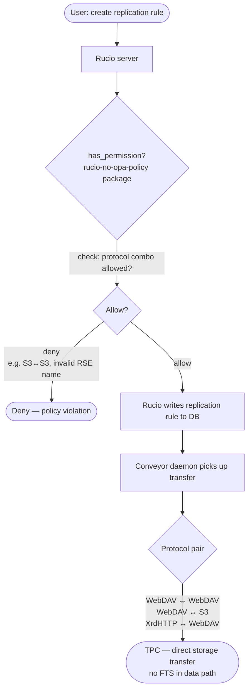
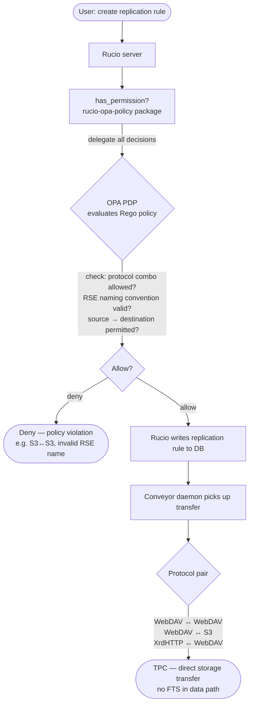

# opa-policy-package

Rucio policy packages — two phases with a clear separation of
concerns:

| Phase | Package | Who decides? | Where is the logic? |
|-------|---------|-------------|---------------------|
| 1 | `rucio-no-opa-policy` | Rucio (PDP) | Inline Python3 (`rules.py`) |
| 2 | `rucio-opa-policy` | OPA (PDP) | Rego (`phase2-opa/rego/`) |

---

## Repository layout

```
opa-policy-package/
│
├── phase1-no-opa/               # Phase 1 — Rucio as PDP
│   ├── pyproject.toml
│   └── src/rucio_no_opa_policy/
│       ├── __init__.py           # SUPPORTED_VERSION
│       ├── permission.py         # has_permission() dispatch
│       └── rules.py              # Protocol & RSE naming logic (pure Python)
│
├── phase2-opa/                   # Phase 2 — OPA as PDP
│   ├── pyproject.toml
│   ├── src/rucio_opa_policy/
│   │   ├── __init__.py           # SUPPORTED_VERSION
│   │   ├── permission.py         # has_permission() → builds input → OPA
│   │   └── opa_client.py         # Thin stdlib HTTP client for OPA REST API
│   ├── rego/
│   │   └── authz.rego    # All authorisation logic in Rego
│   └── docker/
│       ├── docker-compose.yml    # OPA + opa-init + Rucio server
│       └── ingest_policies.py    # Loads Rego + admin data into OPA via REST
│
├── tests/
│   ├── conftest.py               # Rucio stubs + shared fixtures (no live Rucio needed)
│   ├── test_phase1_rules.py      # Unit tests — protocol combos, RSE naming
│   ├── test_phase1_permission.py # Permission dispatch unit tests
│   ├── test_phase1_e2e_scenarios.py  # Scenario tests matching the flowchart
│   ├── test_phase2_opa.py        # OPA client + input construction tests (mocked)
│   └── test_phase2_e2e_scenarios.py  # Scenario tests against live OPA (skip if absent)
│
└── pyproject.toml                # pytest configuration
```

---

## Phase 1 — Rucio as PDP



### What it enforces

**Protocol combos** — TPC transfer paths:

| Source | Destination | Allowed |
|--------|-------------|---------|
| WebDAV | WebDAV | ✓ |
| WebDAV | S3 | ✓ |
| S3 | WebDAV | ✓ |
| XrdHTTP | WebDAV | ✓ |
| S3 | S3 | ✗ — no TPC support |
| S3 | XrdHTTP | ✗ |
| XrdHTTP | XrdHTTP | ✗ |

**RSE naming** — must match `<SITE>_<TYPE>` where TYPE ∈
`{DATADISK, SCRATCHDISK, LOCALGROUPDISK, TAPE, USERDISK}`.

Examples: `CERN_DATADISK` ✓ · `BNL_TAPE` ✓ · `cern_datadisk` ✗ · `CERN_UNKNOWN` ✗

**Actions with custom logic** (all others fall back to root-or-admin):

| Action | Extra check |
|--------|-------------|
| `add_rule` | Protocol combo + RSE naming + standard account check |
| `add_rse` | Admin required **and** RSE name must be valid |
| `update_rse` | Admin required; if renaming, new name must be valid |

**Domain rules run before privilege checks** — even root cannot register
`cern_bad` as an RSE or push an S3→S3 transfer.

### Install

```bash
pip3 install -e phase1-no-opa/
```

### Configure Rucio

```ini
# rucio.cfg
[policy]
package = rucio_no_opa_policy
```

or via environment variable:

```bash
export RUCIO_POLICY_PACKAGE=rucio_no_opa_policy
```

---

## Phase 2 — OPA as PDP



### Integration plan — actions delegated to OPA

The following actions from Rucio's `generic.py` are forwarded to OPA.
All others fall through to a privileged-only default in Rego.

| Category | Actions |
|----------|---------|
| Replication rules | `add_rule`, `del_rule`, `update_rule`, `approve_rule` |
| RSE management | `add_rse`, `update_rse`, `del_rse`, `add_rse_attribute`, `del_rse_attribute` |
| Data Identifiers | `add_did`, `add_dids`, `attach_dids`, `detach_dids` |
| Everything else | → privileged-only fallback in Rego |

To delegate additional actions: add a rule to `authz.rego`, add the
action name to the relevant set in the Rego dispatch section, add any new
kwargs keys to `_PASSTHROUGH_KEYS` in `permission.py`, and add scenario
tests to `test_phase2_e2e_scenarios.py`.

### OPA input document

Every call to `has_permission()` constructs and POSTs this document:

```json
{
  "issuer":   "alice",
  "action":   "add_rule",
  "is_root":  false,
  "is_admin": false,
  "kwargs": {
    "account":            "alice",
    "locked":             false,
    "rse_expression":     "CERN_DATADISK",
    "source_protocol":    "webdav",
    "dst_protocol":       "s3"
  }
}
```

`is_admin` is resolved by `has_account_attribute()` before the HTTP call so
Rego never needs a DB round-trip.

### Start OPA only

```bash
cd phase2-opa/docker
docker compose up -d opa opa-init
# OPA listens on http://localhost:8181
```

Seed admin accounts at startup:

```bash
VO_ADMINS=alice,bob docker compose up -d opa opa-init
```

### Start full stack (OPA + Rucio)

```bash
cd phase2-opa/docker
docker compose --profile full up -d
```

### Install policy package

```bash
pip3 install -e phase2-opa/
```

### Configure

```bash
export RUCIO_POLICY_PACKAGE=rucio_opa_policy
export OPA_URL=http://localhost:8181          # default
export OPA_POLICY_PATH=vo/authz/allow   # default
export OPA_TIMEOUT=2                          # seconds, default
```

### Ingest policies manually

```bash
# Load Rego into a running OPA (useful for CI or Kubernetes init containers)
python3 phase2-opa/docker/ingest_policies.py \
    --opa-url http://localhost:8181 \
    --admins alice,bob,svcaccount
```

### Fail-closed behaviour

If OPA is unreachable (connection refused, timeout, any error) `query_opa()`
returns `False` — the request is denied and the error is logged at `ERROR`
level so it is visible in Rucio server logs.

---

## Running the tests

No Rucio installation needed — Rucio modules are stubbed in `conftest.py`.

```bash
# From the repository root
pip3 install pytest
python3 -m pytest                              # 107 tests (e2e skipped without OPA binary)

# Docker alternative for Phase 2 e2e tests
cd phase2-opa/docker && docker compose up -d opa opa-init
cd ../..
OPA_URL=http://localhost:8181 python3 -m pytest tests/test_phase2_e2e_scenarios.py -v
cd phase2-opa/docker && docker compose down

# With coverage
pip3 install pytest-cov
python3 -m pytest --cov=phase1-no-opa/src --cov=phase2-opa/src --cov-report=term-missing
```

### Test structure

| File | Tests | What it covers |
|------|-------|----------------|
| `test_phase1_rules.py` | 35 | Pure domain logic — protocol combos, RSE naming, kwargs validation |
| `test_phase1_permission.py` | 21 | `has_permission()` dispatch, all covered actions |
| `test_phase1_e2e_scenarios.py` | 30 | Scenario tests: flowchart allow/deny paths |
| `test_phase2_opa.py` | 21 | OPA client (mocked HTTP), fail-closed, input construction incl. `is_admin` |
| `test_phase2_e2e_scenarios.py` | 39 | Live OPA scenarios: protocol combos, RSE naming, DIDs, RSE attrs |

---

## References

- [Rucio Policy Packages tutorial](https://indico.cern.ch/event/1545309/contributions/6742067/attachments/3167370/5629550/Policy%20Package%20Tutorial.pdf)
- [policy-package-template](https://github.com/rucio/policy-package-template)
- [opa-ri-scale reference implementation](https://github.com/federicaagostini/opa-ri-scale/tree/main)
