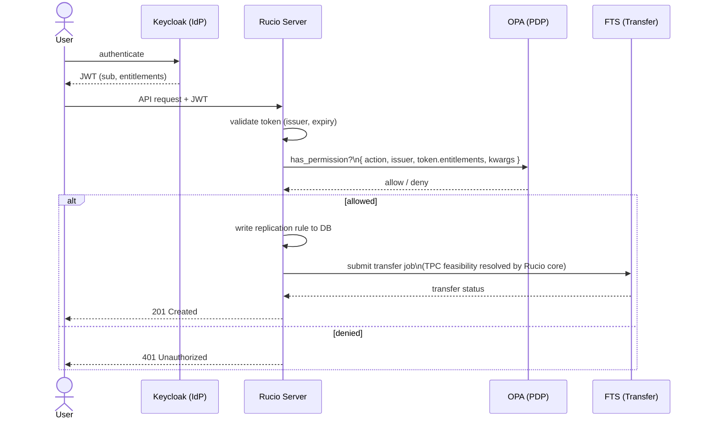

# opa-policy-package

Rucio policy packages across six phases of increasing capability. Each
phase is a drop-in replacement — configure Rucio to point at the desired
package and restart; no data migration required.

| Phase | Package | Who decides? | What changed |
|-------|---------|-------------|---------------|
| 1 | [`rucio-no-opa-policy`](phase1-no-opa/README.md) | Rucio (PDP) | RSE naming enforced in pure Python, no external dependencies. TPC protocol-combo checks were considered but excluded — Rucio core already resolves this per-RSE via `third_party_copy_read`/`third_party_copy_write` protocol flags. |
| 2 | [`rucio-opa-policy`](phase2-opa/README.md) | OPA (PDP) | Policy logic moves to OPA/Rego, delegating a wider set of actions and enabling richer ABAC without redeploying Python code. |
| 3 | [`rucio-opa-v2-policy`](phase3-opa/README.md) | OPA (PDP) | Data-driven configuration, self-service rule management, `attach_dids_to_dids` delegation, protocol scheme enforcement. |
| 4 | [`rucio-opa-v3-policy`](phase4-opa/README.md) | OPA (PDP) | `is_root`/`is_admin` DB lookup replaced by OIDC token-native group evaluation — Keycloak issues JWTs with `wlcg.groups`; OPA evaluates against `data.vo.group_policy`, with no DB lookup in the decision path. |
| 5 | [`rucio-opa-v4-policy`](phase5-opa/README.md) | OPA (PDP) | Phase 4's WLCG group paths replaced by URN-based entitlement claims — Keycloak issues an `entitlements` claim (sourced from a user attribute, not the group tree); OPA evaluates against `data.vo.entitlement_policy`. Same token-native model as Phase 4, only the claim shape changed. |
| 6 | [`rucio-opa-v5-policy`](phase6-opa/README.md) | OPA (PDP) | Same entitlement model as Phase 5, demonstrated end to end against real third-party-copy transfers through FTS — XRootD SciTokens (XRD3 → XRD4), Teapot WebDAV (TEAPOT1 → TEAPOT2) and both cross-protocol directions, with OIDC token exchange validated on the wire by each storage endpoint. Adds an RSE-name allowlist in Rego for the testbed RSEs. |

> See [Policy package mechanism](docs/policy-package-mechanism.md) for how Rucio loads policy packages.
> See [Action → Policy Mapping](docs/action-policy-mapping.md) for the full `has_permission()` coverage map — **required reading for writing meaningful Rego or ODRL policies** (action strings, available input fields and domain checks that apply independently of privilege).
> See [Policy Lifecycle](docs/policy-lifecycle.md) for the ODRL → OPA → Rucio relationship and input document options.
> See [Authorisation flows](docs/authz-flow-diagrams.md) for how privilege is resolved and what each action requires.

See [BACKLOG.md](BACKLOG.md) for planned work not yet scheduled into a phase.

## High-level vision

```mermaid
sequenceDiagram
    actor User
    participant KC as Keycloak (IdP)
    participant Rucio as Rucio Server
    participant OPA as OPA (PDP)
    participant FTS as FTS (Transfer)

    User->>KC: authenticate
    KC-->>User: JWT (sub, entitlements)

    User->>Rucio: API request + JWT
    Rucio->>Rucio: validate token (issuer, expiry)
    Rucio->>OPA: has_permission?\n{ action, issuer, token.entitlements, kwargs }
    OPA-->>Rucio: allow / deny

    alt allowed
        Rucio->>Rucio: write replication rule to DB
        Rucio->>FTS: submit transfer job\n(TPC feasibility resolved by Rucio core)
        FTS-->>Rucio: transfer status
        Rucio-->>User: 201 Created
    else denied
        Rucio-->>User: 401 Unauthorized
    end
```

Phases 4–6 implement this end to end: Keycloak issues the claim, Rucio
decodes it at token validation and forwards it to OPA, and OPA evaluates it
against the bundle — no Rucio DB round-trip per decision. Phase 6 also
drives the transfer leg token-natively, with FTS obtaining storage tokens by
RFC 8693 exchange.

Carrying claims from the validated token into `has_permission()` needs four
small patches to Rucio, mounted from `patches/rucio/` — see
[design-001](docs/design/design-001-token-claims-to-opa.md). Rego action
coverage is still partial; actions without a rule fall through to
privileged-only.

## Group membership and URN entitlements

Phase 4 used WLCG group paths as the privilege signal. Phases 5 and 6
replace this with URN-based entitlement claims, preserving the same group
information in a federated-AAI-friendly shape:

| Phase 4 (wlcg.groups) | Phases 5–6 (URN entitlement) |
|----------------------|---------------------------|
| `/rucio/admins` | `urn:example:aai.example.org:group:rucio-admins:role=member` |
| `/atlas/production` | `urn:example:aai.example.org:group:atlas-production:role=member` |

The bundle (`data.vo.group_policy` in phase 4, `data.vo.entitlement_policy`
in 5–6) is the mapping layer, updatable at runtime without redeployment.
Only the claim key and the Rego lookup differ between the two.

Fine-grained, resource-level permissions beyond group/role membership are
deferred — see [BACKLOG.md](BACKLOG.md).

## References

- [Rucio Policy Packages tutorial](https://indico.cern.ch/event/1545309/contributions/6742067/attachments/3167370/5629550/Policy%20Package%20Tutorial.pdf)
- [policy-package-template](https://github.com/rucio/policy-package-template)
- [opa-ri-scale reference implementation](https://github.com/federicaagostini/opa-ri-scale/tree/main)
