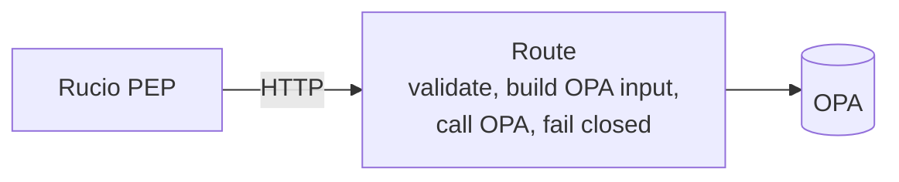
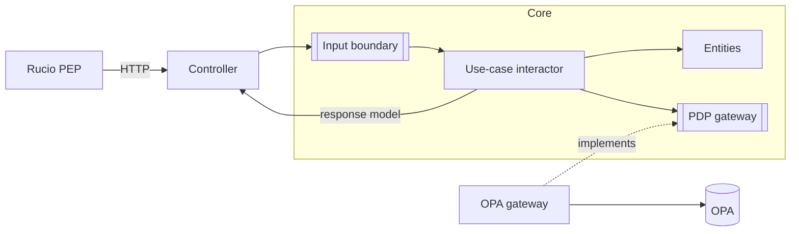
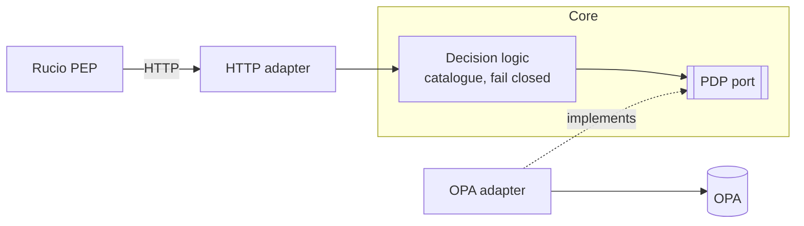
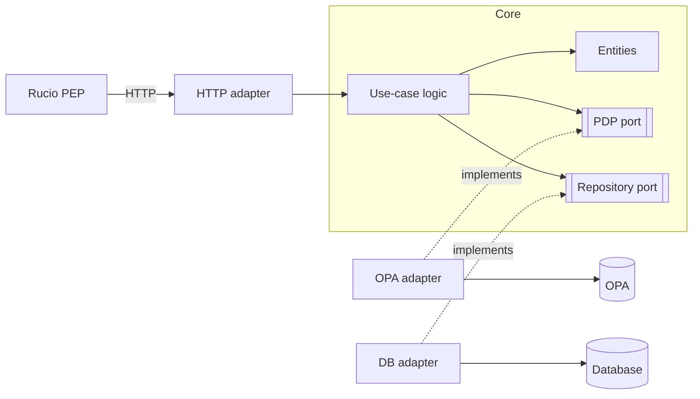

# Authorization Service implementation: architecture, stack, testing and telemetry

## Context and Problem Statement

The [API-first ADR](./adr-001-authz-service.md) establishes a WP4-owned
Authorization Service in front of OPA, and
[design-005](../design/design-005-authorization-service-api.md) defines its
contract. This ADR records how the service is built and why: its architecture,
stack, testing strategy and telemetry, and the properties that must not change
by accident.

The service is small by nature. Policy lives in Rego, and resource facts are
resolved by the PEP. The service maps a typed request onto the PDP's input,
calls the PDP, fails closed, and records the decision. It keeps no state.

How the decisions are carried out — layout, tooling, versions, telemetry names,
test fixtures, conformance checks and sequencing — is in
[design-006](../design/design-006-authorization-service-implementation.md).

## Decision Drivers

* Reuse the existing Python work in the policy packages and their tests.
* Keep the PDP replaceable through a real seam, as the API-first ADR requires,
  rather than by convention.
* Keep the structure proportionate to a thin, stateless service.
* Establish correctness against the real policy, which only a real PDP can
  execute.
* Make every decision observable and auditable without the service owning
  storage.
* The PEP client must run inside Rucio's Python 3.9 runtime.

## Considered Options

**Architecture**
1. Plain layered application: routes call the PDP directly.
2. Clean Architecture: dependencies point inward, and the inside is divided into
   prescribed boundaries (entities, use cases, interface adapters).
3. Ports and adapters (hexagonal): dependencies point inward too, but only the
   boundary between the core and the outside world is prescribed.

Options 2 and 3 are not competing philosophies. Both keep the core independent
of infrastructure; they differ in how much internal structure they prescribe.

**Testing**
- A. Unit tests with a mocked PDP as the primary suite.
- B. Integration tests against the real PDP only.
- C. Integration tests authoritative, plus unit tests restricted to pure logic.

**Telemetry**
- I. Framework logging plus a separate metrics library.
- II. OpenTelemetry for traces, metrics and logs.

## Decision Outcome

Chosen: **3. Ports and adapters**, **C. Integration tests authoritative**, and
**II. OpenTelemetry**, implemented in **Python with FastAPI** and API models
generated from the contract.

* **Architecture.** A decision core owns the domain model and fail-closed
  handling and defines a PDP port. HTTP is the inbound adapter and OPA the
  outbound one. Requests pass through three representations only: the generated
  API model, the core model, and the PDP-specific input.

  This does not reject Clean Architecture. It adopts the same dependency rule
  without imposing inner boundaries that have no responsibilities yet. If the
  core later gains substantial domain logic or persistence, entities, use cases
  and further ports (such as a repository) can be introduced inside the same
  boundary without restructuring the adapters.
* **Stack.** Python, to reuse existing work. FastAPI with generated models, so
  the contract, not hand-written code, defines request validation.
* **Correctness.** A change is correct when integration tests pass against the
  real PDP running the real policy. Unit tests are allowed only for pure logic
  and never stand in for an external service.
* **Observability.** Traces and metrics go out through OpenTelemetry. Each
  decision emits one audit record, kept separate from application logs. The
  service persists nothing; retention and access control belong to whoever
  operates the telemetry backend.
* **PEP client.** It stays compatible with Rucio's Python 3.9 runtime, using
  generated models from a pinned generator that still supports it.

### Invariants

These are the durable part of this decision. Tooling, versions and
configuration may change without a new ADR. These may not.

* **Fail closed.** A PEP never receives a permit that results from a PDP
  failure. Only an explicit permit from the PDP produces a permit.
* **Alignment.** The contract's operations, the service's routes and catalogue,
  the PEP client and the policy's known actions stay identical.
* **Dependency direction.** The core never depends on adapters, the web
  framework or telemetry exporters.
* **Audit data boundary.** Subject and resource information leaves the service
  only in audit records, never in application logs, span attributes or
  metrics, and raw tokens are never emitted.

### Consequences

#### Positive

* The PDP can be replaced behind its port, provided the new PDP reproduces the
  contract's decisions.
* Passing tests mean the service, the mapping and the policy agree.
* Decisions are traceable end to end without a database.
* Existing Python work and test vectors carry over.
* The core can grow towards Clean Architecture's inner structure when there is
  logic to justify it, without changing the boundary.

#### Negative

* Integration tests need Docker, and feedback is slower than with unit tests.
* Supporting Python 3.9 ties the PEP client to an older generator until Rucio's
  runtime is upgraded.
* Audit records identify the subject and the resources accessed, so the
  telemetry backend falls under data-protection governance. Which identifiers
  are recorded, and whether they are pseudonymised, is decided in design-006.

### Confirmation

Each invariant has an automated check that runs in CI. The checks and how they
run are defined in design-006, under "Conformance checks". This ADR is confirmed
when every invariant has a check and all checks pass.

## Pros and Cons of the Options

### 1. Plain layered application

* Good, because it is the least code.
* Bad, because the PDP's input shape and client leak into the routes, so the
  seam exists only by convention.

### 2. Clean Architecture

Shown without a presenter and view model, a common simplification for APIs.

* Good, because its dependency rule provides the same PDP independence.
* Bad, because it prescribes inner boundaries (input boundaries, use-case
  interactors and request and response models per operation) that currently
  have no responsibilities in a thin, stateless service.
* Neutral, because those boundaries can still be introduced later if the core
  gains substantial domain logic.

### 3. Ports and adapters

Today, only the boundary is prescribed:

Later, with persistence, the core grows and the boundary stays:

* Good, because the one boundary that matters, the PDP, is an explicit port.
* Good, because the core's internal structure can follow its actual complexity,
  ending close to option 2 if that complexity arrives.
* Bad, because the dependency rule must be enforced by tooling.

### A. Unit tests with a mocked PDP

* Good, because feedback is fast and needs no containers.
* Bad, because a mock asserts what the service sends, not what the policy
  decides.

### B. Integration tests only

* Good, because every test proves a real decision.
* Bad, because pure logic can only be diagnosed through a wrong decision.

### C. Integration tests authoritative, plus unit tests for pure logic

* Good, because it keeps B's guarantee and adds precise failures for pure logic.
* Bad, because the "pure logic" boundary needs enforcing.

### I. Framework logging and a metrics library

* Good, because it is simple.
* Bad, because signals cannot be correlated across Rucio, the service and OPA.

### II. OpenTelemetry

* Good, because one vendor-neutral mechanism carries all signals and correlates
  them.
* Bad, because it adds dependencies and configuration.
