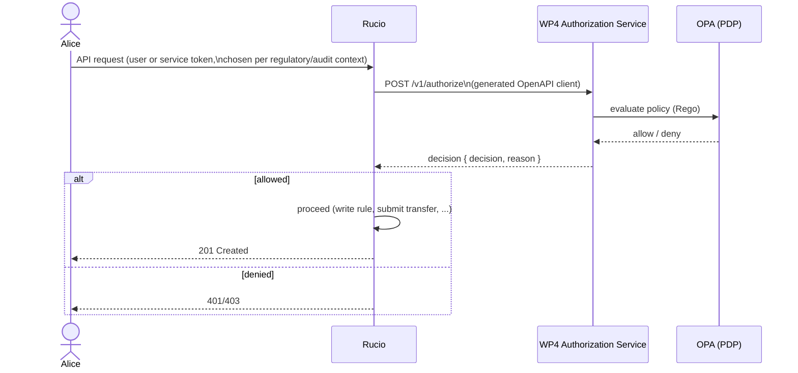
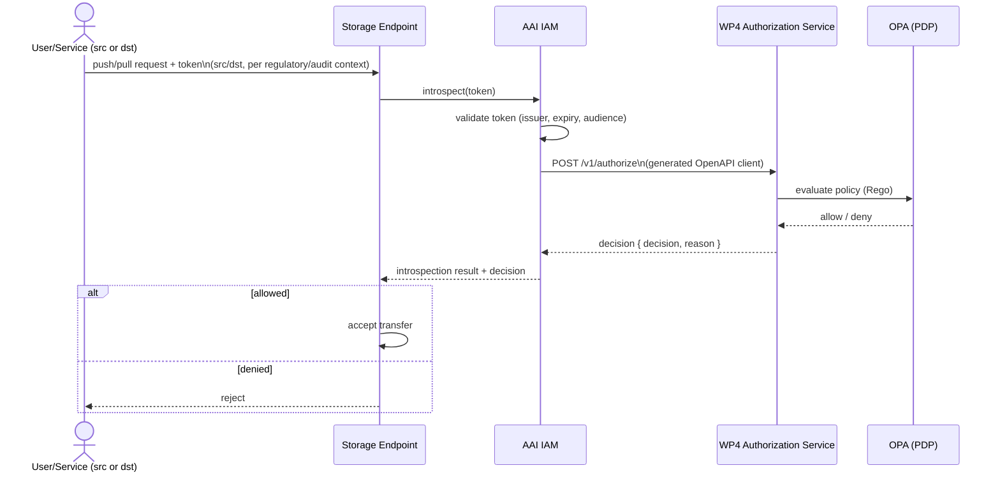
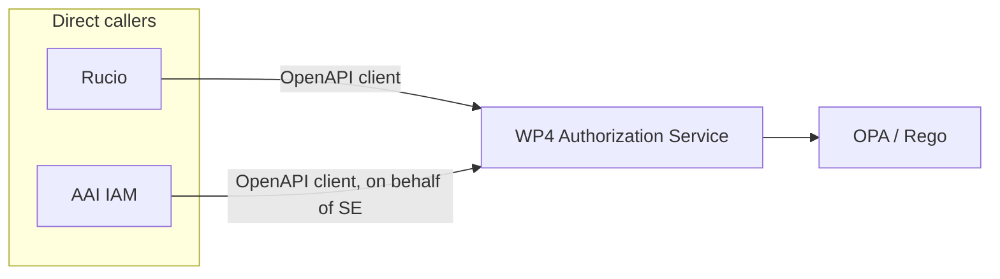
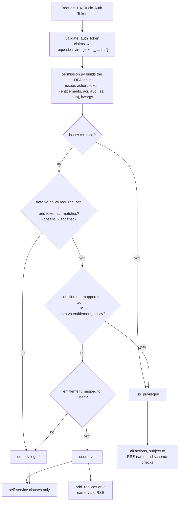
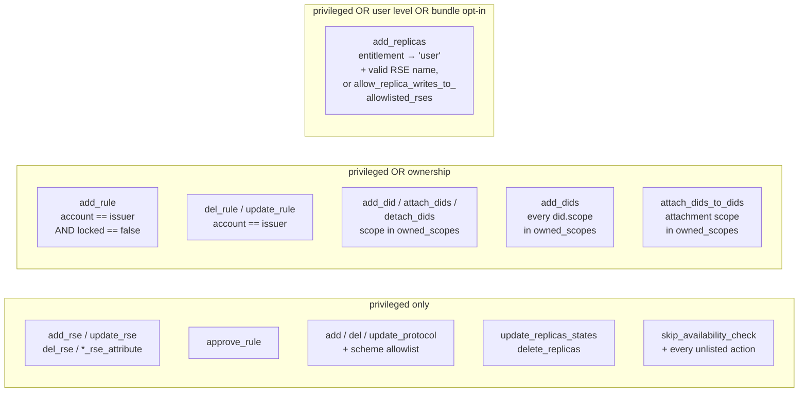

# Authorization Flows via WP4 Authorization Service

Two consumer flows share the same integration pattern: caller obtains/holds a token appropriate to the regulatory context (GDPR, FDA, etc.) for audit purposes, then calls the WP4 Authorization Service through a client generated from its OpenAPI spec. The Authorization Service is the only component that talks to OPA.

## 1. Rucio → Authorization Service → OPA

Notes:
- Rucio never talks to OPA directly. It only knows the Authorization Service's OpenAPI contract.
- Token type (user vs. service token) is a Rucio-side concern driven by regulatory/audit requirements, not an Authorization Service concern — the service receives whatever subject/context the OpenAPI schema defines, regardless of which token backed it.

## 2. Storage endpoint → IAM (which hooks into the Authorization Service) → OPA

Notes:
- The storage endpoint only ever calls IAM. IAM performs introspection and, within that same request handling, calls the Authorization Service on the storage endpoint's behalf — the SE does not call the Authorization Service directly.
- Token validation (issuer, expiry, audience) and the authorization decision remain two distinct operations against two distinct systems (IAM's own validation, then IAM's call out to the Authorization Service); they are logged as separate steps even though the storage endpoint sees them as a single response.
- This is a **new consumer relationship** not previously modeled in the action mapping: IAM acts as an authorization client for storage access flows, using the same Authorization Service contract as Rucio while supplying a token-centric authorization context.

## Shared architectural point for both flows

Rucio and IAM are the only direct callers of the Authorization Service. Storage endpoints reach it indirectly through IAM; FTS does not call it at all — its transfers are already authorized upstream by Rucio and re-checked downstream at the storage endpoint. Every direct caller generates its client from the same OpenAPI spec. OPA and Rego stay internal to the Authorization Service; no caller is coupled to Rego input shapes, which is the core reason a generated-client contract is viable here and isn't for Rego directly.

## Phase 6 — entitlement-driven authorisation

### What each action requires

| Action group | root | `rucio-admins` | `rucio-users` | no entitlement / userpass |
|---|---|---|---|---|
| RSE, protocol, approval, unlisted | ✓ | ✓ | ✗ | ✗ |
| `add_replicas` | ✓ | ✓ | valid RSE name | only with bundle flag |
| Rules | ✓ | ✓ | own account, unlocked, valid RSE | same |
| DIDs | ✓ | ✓ | own scope | same |

Verified by `tests/test_phase6_rucio.py`: `TestEntitlementAuthorisation`
covers the privileged path, `TestScopeOwnership` and `TestBulkScopeOwnership`
the ownership clauses against the scopes table, and `TestRuleSelfService` the
`kwargs.account` comparison. `tests/test_phase6_opa.py` covers the same rules
against synthetic input.
