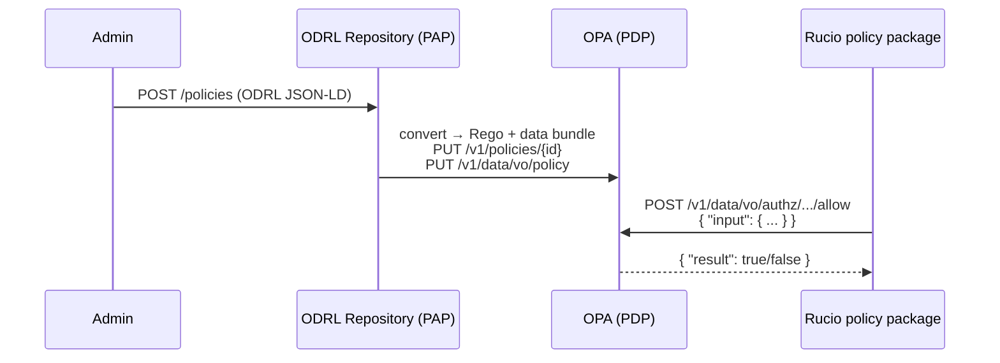

# Policy Lifecycle: ODRL → OPA → Rucio



---

## Responsibilities

| Layer | Role | Called by Rucio package? |
|-------|------|--------------------------|
| ODRL Repository | Author and manage policies in JSON-LD | No |
| Conversion + ingest | Translate ODRL → Rego, push to OPA | No — deploy-time only |
| OPA | Evaluate input document against Rego | Yes — only endpoint |

---

## OPA input document — two mapping options

### Option A — Rucio-native (current, Phase 1–3)

Privilege flags (`is_root`, `is_admin`) are resolved in Python from the Rucio
DB before the OPA call. OPA receives a flat, Rucio-specific input document.

```json
{
  "input": {
    "issuer":   "alice",
    "action":   "add_rule",
    "is_root":  false,
    "is_admin": false,
    "kwargs": {
      "account": "alice", "locked": false,
      "rse_expression": "CERN_DATADISK",
      "source_protocol": "s3", "dst_protocol": "webdav"
    }
  }
}
```

| ODRL | OPA input |
|------|-----------|
| `assigner` / `assignee` | `issuer`, `kwargs.account` |
| `target` | `kwargs.rse_expression`, `kwargs.scope` |
| `action` | `action` |
| `constraint` | `kwargs.locked`, `kwargs.source_protocol`, ... |
| _(derived)_ | `is_root`, `is_admin` — resolved in Python |

### Option B — Claims-based / token-native (Phase 4 target)

The input carries raw token claims. OPA resolves group membership and roles
directly from the token — no DB call in Python, no pre-resolved privilege flags.

```json
{
  "input": {
    "action": "add_rule",
    "resource": { "rse_expression": "CERN_DATADISK" },
    "token": {
      "entitlements": [
        "urn:example:aai.example.org:group:rucio:role=admin"
      ]
    }
  }
}
```

OPA evaluates the URN entitlements against a group-to-privilege mapping in
the data bundle — no Rucio DB round-trip per request. Token introspection
and a trusted issuer list in the bundle replace the `is_root`/`is_admin` flags.

---

Rucio has no knowledge of ODRL. Whether the Rego inside OPA was hand-authored
or generated from ODRL documents makes no difference to the package — only
the boolean result matters.
