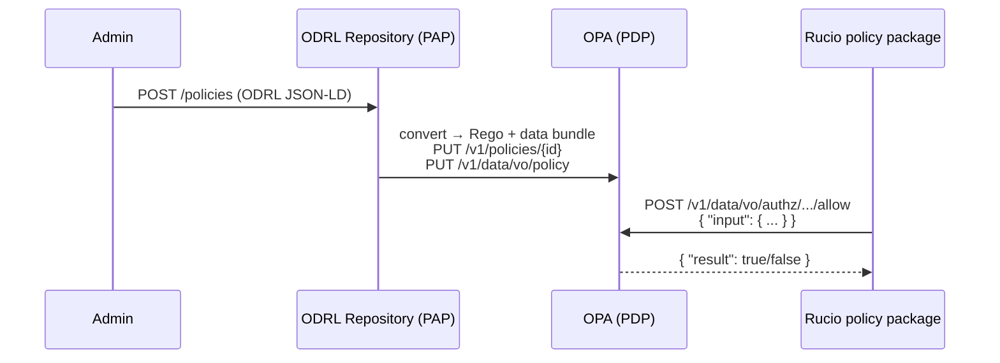

# Policy Lifecycle: ODRL → OPA → Rucio


```mermaid
sequenceDiagram
    participant Admin
    participant PAP as ODRL Repository (PAP)
    participant OPA as OPA (PDP)
    participant Rucio as Rucio policy package

    Admin->>PAP: POST /policies (ODRL JSON-LD)
    PAP->>OPA: convert → Rego + data bundle<br/>PUT /v1/policies/{id}<br/>PUT /v1/data/vo/policy
    Rucio->>OPA: POST /v1/data/vo/authz/.../allow<br/>{ "input": { ... } }
    OPA-->>Rucio: { "result": true/false }
```

## Responsibilities

| Layer | Role | Called by Rucio package? |
|-------|------|--------------------------|
| ODRL Repository | Author and manage policies in JSON-LD | No |
| Conversion + ingest | Translate ODRL → Rego, push to OPA | No — deploy-time only |
| OPA | Evaluate input document against Rego | Yes — only endpoint |

## OPA input document — two mapping options

### Option A — Rucio-native (Phase 1–3)

Privilege flags (`is_root`, `is_admin`) are resolved in Python from the Rucio
DB before the OPA call. OPA receives a flat, Rucio-specific input document.

```json
{
  "input": {
    "issuer":   "alice",
    "action":   "add_rule",
    "is_root":  false,
    "is_admin": false,
    "kwargs": {
      "account": "alice", "locked": false,
      "rse_expression": "CERN_DATADISK"
    }
  }
}
```

| ODRL | OPA input |
|------|-----------|
| `assigner` / `assignee` | `issuer`, `kwargs.account` |
| `target` | `kwargs.rse_expression`, `kwargs.scope` |
| `action` | `action` |
| `constraint` | `kwargs.locked`, ... |
| _(derived)_ | `is_root`, `is_admin` — resolved in Python |

### Option B — Claims-based / token-native (Phase 4/5/6)

No `is_root`/`is_admin` pre-resolution — the claims of the validated token are
forwarded under `token` and OPA resolves privilege from them. One membership
claim differs per phase; the scalars are the same everywhere.

Phase 4 forwards `token.groups`, from the token's `wlcg.groups`:

```json
{
  "input": {
    "issuer": "alice",
    "action": "add_rule",
    "token": {
      "groups": ["/rucio/users", "/atlas/users"],
      "acr": "https://refeds.org/profile/mfa",
      "aud": "rucio",
      "iss": "http://keycloak:8080/realms/rucio",
      "sub": "8b14e07a-3f52-4d6c-91ab-2e70d5c48f93"
    },
    "kwargs": { "account": "alice", "locked": false,
                "rse_expression": "CERN_DATADISK" }
  }
}
```

Phases 5 and 6 forward `token.entitlements` (URN strings) in its place, with
`token.groups` absent:

```json
    "token": {
      "entitlements": ["urn:example:aai.example.org:group:rucio-admins:role=member"],
      "acr": "https://refeds.org/profile/mfa",
      "aud": "rucio",
      "iss": "http://keycloak:8080/realms/rucio",
      "sub": "2f61b40c-93d7-4e18-8a52-7c09e4d6ab31"
    }
```

The forwarded set is an allowlist in `permission.py`, not the raw payload —
adding a claim to policy means adding it there first. Scalar claims appear
only when the token carries them; the membership claim is always present, so a
Rego clause iterating it is safe.

`kwargs.owned_scopes` is not a claim. It is resolved from the `scopes` table
per request and is always present, empty when the action names no scope — so a
Rego `in` test against it is safe for every action, not just DID ones.

Rucio has no knowledge of ODRL. Whether the Rego inside OPA was hand-authored
or generated from ODRL documents makes no difference to the package — only
the boolean result matters.
