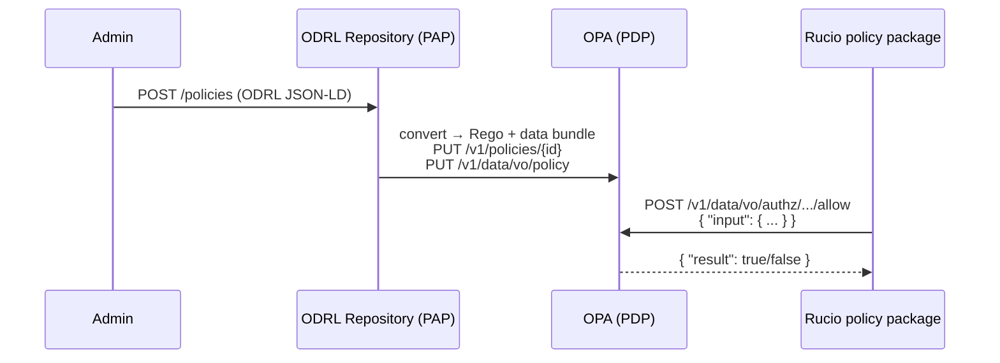

# Policy Lifecycle: ODRL → OPA → Rucio


```mermaid
sequenceDiagram
    participant Admin
    participant PAP as ODRL Repository (PAP)
    participant OPA as OPA (PDP)
    participant Rucio as Rucio policy package

    Admin->>PAP: POST /policies (ODRL JSON-LD)
    PAP->>OPA: convert → Rego + data bundle<br/>PUT /v1/policies/{id}<br/>PUT /v1/data/vo/policy
    Rucio->>OPA: POST /v1/data/vo/authz/.../allow<br/>{ "input": { ... } }
    OPA-->>Rucio: { "result": true/false }
```

## Responsibilities

| Layer | Role | Called by Rucio package? |
|-------|------|--------------------------|
| ODRL Repository | Author and manage policies in JSON-LD | No |
| Conversion + ingest | Translate ODRL → Rego, push to OPA | No — deploy-time only |
| OPA | Evaluate input document against Rego | Yes — only endpoint |

## OPA input document — two mapping options

### Option A — Rucio-native (Phase 1–3)

Privilege flags (`is_root`, `is_admin`) are resolved in Python from the Rucio
DB before the OPA call. OPA receives a flat, Rucio-specific input document.

```json
{
  "input": {
    "issuer":   "alice",
    "action":   "add_rule",
    "is_root":  false,
    "is_admin": false,
    "kwargs": {
      "account": "alice", "locked": false,
      "rse_expression": "CERN_DATADISK"
    }
  }
}
```

| ODRL | OPA input |
|------|-----------|
| `assigner` / `assignee` | `issuer`, `kwargs.account` |
| `target` | `kwargs.rse_expression`, `kwargs.scope` |
| `action` | `action` |
| `constraint` | `kwargs.locked`, ... |
| _(derived)_ | `is_root`, `is_admin` — resolved in Python |

### Option B — Claims-based / token-native (Phase 4/5)

No `is_root`/`is_admin` pre-resolution. OPA resolves privilege directly from
a claim forwarded under `token` — no DB call in Python. Phase 4 forwards
`token.groups` (WLCG group paths); Phase 5 forwards `token.entitlements`
(URN strings) instead. Same shape either way, different claim key and value
format:

```json
{
  "input": {
    "issuer": "alice",
    "action": "add_rule",
    "token": {
      "entitlements": ["urn:example:aai.example.org:group:rucio-admins:role=member"]
    },
    "kwargs": { "account": "alice", "locked": false,
                "rse_expression": "CERN_DATADISK" }
  }
}
```

OPA evaluates the claim against a group/entitlement-to-privilege mapping in
the data bundle (`data.vo.group_policy` or `data.vo.entitlement_policy`) —
no Rucio DB round-trip per request. The bootstrap `root` account (userpass,
no token) is allowed unconditionally by a separate Rego rule.

**Not the same as the Authorization Service contract.** The `operation` /
`subject` / `resource` / `context` shape used by the WP4 Authorization
Service (see the ADRs and `authz-flow-diagrams.md`) is a separate, higher
layer that this package's OPA input predates and does not implement — this
policy package still talks to OPA directly, not through that service.

Rucio has no knowledge of ODRL. Whether the Rego inside OPA was hand-authored
or generated from ODRL documents makes no difference to the package — only
the boolean result matters.
