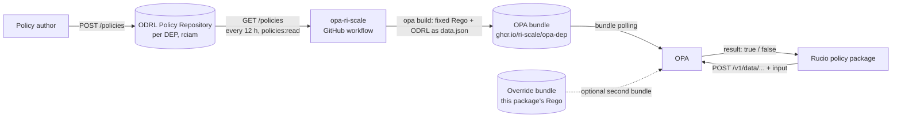

# Policy lifecycle: ODRL → OPA → Rucio

How RI-SCALE WP4's ODRL policies reach OPA, where this package's Rego fits,
and what Rucio sends OPA. As of October 2026; see the open questions at the end.

## Flow


```mermaid
flowchart LR
    A[Policy author] -->|POST /policies| R[(ODRL Policy Repository<br/>per DEP, rciam)]
    R -->|GET /policies<br/>every 12 h, policies:read| W[opa-ri-scale<br/>GitHub workflow]
    W -->|opa build: fixed Rego + ODRL as data.json| B[(OPA bundle<br/>ghcr.io/ri-scale/opa-dep)]
    B -->|bundle polling| O[OPA]
    X[(Override bundle<br/>this package's Rego)] -.->|optional second bundle| O
    P[Rucio policy package] -->|POST /v1/data/... + input| O
    O -->|result: true / false| P
```

| Piece | Changes when | Notes |
|---|---|---|
| ODRL policies | Policies are edited in the repository | JSON in the repository, then `data.dep…` in OPA. **No Rego is generated.** |
| `dep` Rego ([opa-ri-scale](https://github.com/RI-SCALE/opa-ri-scale) `OPA/src/dep`) | Rarely; it's the evaluator | Parses the ODRL data at query time. Matches action, target, assignee, `acr` and entitlement only. |
| This package's Rego (`policies/rego/phaseN/authz.rego`) | Rucio logic changes | Ownership, RSE naming, scheme allowlist, root bootstrap. Not expressible in their ODRL. Today it's ingested by `scripts/ingest_policies.py`, together with `data.vo.*`. |
| `system.authz` Rego (opa-ri-scale) | — | OPA's own API needs a bearer token, introspected per call. |

OPA never "understands" ODRL. A fixed Rego evaluator reads the ODRL as data,
so updating a policy is a data change, delivered with the next bundle build.

### Where Rucio fits

Today Rucio queries this package's Rego (`vo.authz.v5`), with privilege tiers
taken from `data.vo.entitlement_policy`. The intended hybrid:

- **ODRL (WP4 repository)** decides *who holds which tier*: DEP entitlement → admin / user.
- **This package's Rego (override bundle)** keeps ownership and domain checks,
  and takes the tier from `data.dep` instead of `data.vo.entitlement_policy`.
- Rucio keeps querying its own decision path.

## OPA input document

What `permission.py` sends OPA (phases 4–6). Phases 1–3 used a flat
`is_root`/`is_admin` input; see the `archive/phases-1-3` tag.

There is no `is_root`/`is_admin` pre-resolution. The validated token's claims
are forwarded under `token`, and OPA resolves privilege from them. The
membership claim differs per phase; the scalars are the same everywhere.

Phase 4 forwards `token.groups`, taken from the token's `wlcg.groups`:

```json
{
  "input": {
    "issuer": "alice",
    "action": "add_rule",
    "token": {
      "groups": ["/rucio/users", "/atlas/users"],
      "acr": "https://refeds.org/profile/mfa",
      "aud": "rucio",
      "iss": "http://keycloak:8080/realms/rucio",
      "sub": "8b14e07a-3f52-4d6c-91ab-2e70d5c48f93"
    },
    "kwargs": {
      "account": "alice",
      "locked": false,
      "rse_expression": "CERN_DATADISK",
      "dids": [{"scope": "alice", "name": "f1"}],
      "owned_scopes": ["alice"]
    }
  }
}
```

Phases 5 and 6 forward `token.entitlements` (URN strings) in its place, and
`token.groups` is absent:

```json
"token": {
  "entitlements": ["urn:example:aai.example.org:group:rucio-admins:role=member"],
  "acr": "https://refeds.org/profile/mfa",
  "aud": "rucio",
  "iss": "http://keycloak:8080/realms/rucio",
  "sub": "2f61b40c-93d7-4e18-8a52-7c09e4d6ab31"
}
```

- **The forwarded claims are an allowlist** in `permission.py`, not the raw
  payload. Using a new claim in policy means adding it there first. Scalar
  claims appear only when the token carries them. The membership claim is
  always present, so a Rego clause iterating it is safe.
- **`kwargs.owned_scopes` is not a claim.** It is resolved from the `scopes`
  table per request and is always present (empty when the action names no
  scope), so a Rego `in` test against it is safe for every action.
- **`kwargs.rule_owner` and `kwargs.rule_scope`** are resolved from the
  `rules` table for `del_rule` and `update_rule`. They are omitted when the
  rule can't be resolved, and the Rego denies (fail closed).

Rucio has no knowledge of ODRL. Whether OPA evaluates hand-authored Rego or
WP4's evaluator reading ODRL as data makes no difference to the package —
only the boolean result matters.

## Open questions

- **Read access to the policy repository:** which client or scope gives
  `policies:read`? EGI Check-In dev rejects it for our client with
  `invalid_scope`. Asked WP4.
- **OPA API auth:** the PEP must send a bearer token, with remote
  introspection on every decision. What does that cost in latency for Rucio,
  and can a sidecar OPA disable it?
- **`constraint_is_matched` defaults to `true`.** Does a failing `acr`
  constraint still match? Verify with a test.
- **`target` IRI for Rucio:** one per VO, or one per DEP?
- **Pagination:** `get-policies.sh` fetches one page only (`limit` 20), so
  policies beyond 20 are silently dropped.
- **Real entitlements per DEP:** for EGI Check-In they take the form
  `urn:mace:egi.eu:group:<GROUP>:<SUBGROUP>:role=<ROLE>#aai.egi.eu`.

## References

- [opa-ri-scale](https://github.com/RI-SCALE/opa-ri-scale) — evaluator, bundle workflow, override docs
- [ODRL Policy Repository API](https://github.com/RI-SCALE/odrl-policy-repository-api), [reference implementation](https://github.com/rciam/rciam-odrl-policy-repo)
- [design-doc-004](https://github.com/RI-SCALE/dep-dlm-testbed/blob/main/docs/design/design-doc-004-direct-opa-integration.md) — direct OPA integration in dep-dlm-testbed
